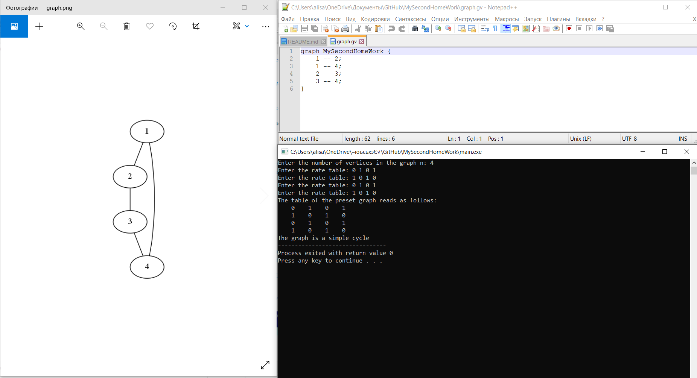
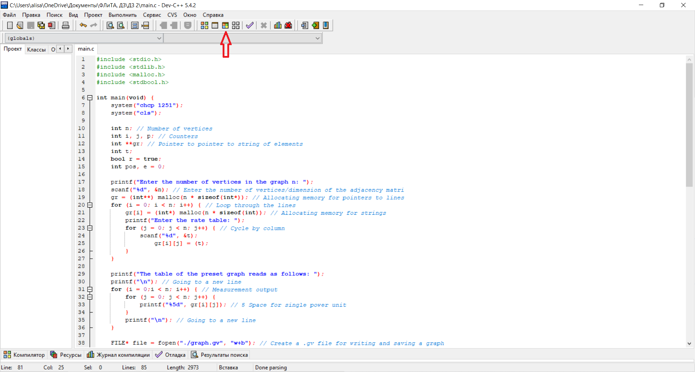

# The second Homework assignment on the subject: "Functional Logic and the Theory of Algorithms"
## *Task condition (variant № 1):*
> "The user enters the number of vertices in the graph as well as the adjacency table. 
>  It is necessary to check if this graph is a simple cycle"


### Project assembly:
The program is written in the Windows operating system, in the Dev-C++ application in the C programming language.


### Explanation of the algorithm of the code:
After entering the number of vertices of the graph, we allocate memory for a two-dimensional dynamic array, 
otherwise words, for pointers to pointers to a string. Next, we fill our array line by line:
```c   
	gr = (int**) malloc(n * sizeof(int*)); // Allocating memory for pointers to lines
	for (i = 0; i < n; i++) { // Loop through the lines
		gr[i] = (int*) malloc(n * sizeof(int)); // Allocating memory for strings
		printf("Enter the rate table: ");
		for (j = 0; j < n; j++) { // Cycle by column
			scanf("%d", &t);
			gr[i][j] = (t);
		}
	}
```
Then we display the adjacency table to the user:
```c
	printf("The table of the preset graph reads as follows: ");
	printf("\n"); // Going to a new line
	for (i = 0;i < n; i++) { // Measurement output
		for (j = 0; j < n; j++) {
			printf("%5d", gr[i][j]); // 5 Space for single power unit
		}
		printf("\n"); // Going to a new line
	}
```
We create a .gv file, where we will record all the connections of our graph, i.e. ribs:
```c
	FILE* file = fopen("./graph.gv", "w+b"); // Create a .gv file for writing and saving a graph
	fputs("graph MySecondHomeWork {\n", file); // Writing the first line in the file
	for (i = 0;i < n; i++) 
		for (j = i; j < n; j++)
			if (gr[i][j] == 1) // If we are entering the matrix of the unit
							   //(i.e. there is a link between the top)
				fprintf(file, "\t%d -- %d;\n", i+1, j+1); // We write down the link in the created file
														  // "\ t" - horizontal tabulation, call right to write the code in the file
	fputs("}", file); // End of the code
	fclose(file); // Closing a file
```
Сreate a .png file, where there will be a graphical display of our graph:
```c
	system("dot -Tpng graph.gv -o graph.png"); // Creating a graphic visualization using a .gv file
```
Next, we check the graph for cyclicality, moving through our dynamic array. 
We created a separate pointer to the array, which is zeroed at the very beginning, so that later we could use it to determine whether the graph is a simple cycle or not.
```c
	bool* ch = (bool*) calloc(n, sizeof(bool)); // We create an index on the mass for checking the cycle of the graph
	
	for (i = 0; i < n - 1; ++i) {
		ch[p] = true; // The top of the line is marked
		for (j = 0; j < n; ++j) { // Cycle by line
			if ((ch[j] == false) && (gr[i][j] == true)) {
				p = j;
				break;
			}
		}
		if (j == n) // If the counter j is the correct mass length / number of points
			r = false; // The r variable takes on the value "false"
	}
	if (gr[p][pos] == false) 
		r = false;
	
	for (i = 0; i < n; ++i) {
		for (j = i; j < n ; ++j)
			if (gr[i][j] == true)
				++e;
	}
	if (e != n) // If e is not equal to the number of vertices, then
		r = false; // The r variable takes on the value "false"
	free (ch);
```
Then the result is displayed and the dynamic memory is cleared:
```c
	for (i = 0; i < n; i++) // Clearing memory, looping through the lines
		free(gr[i]); // Freeing memory for a string
	free(gr);
```
### The result of the program:



---
### Launch the project: 
To start the project, you need to open the main.c file in the Dev-C++ application. 
Next, you need to click on the "Compile and execute" button or press F11



